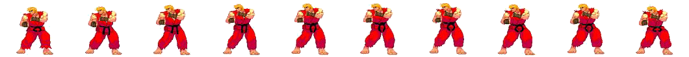
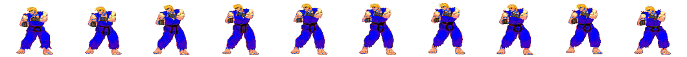
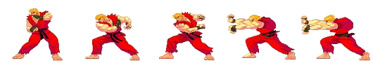
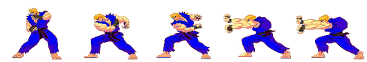
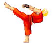
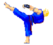
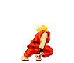
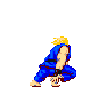
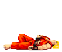
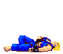

# ECS Fighting Game

A 2D browser fighting game built with **vanilla JavaScript** using the **Entity Component System (ECS)** architectural pattern. Created as a functional programming course project.

---

## Gameplay

<div align="center">

| Player (Ken) | VS | Enemy (Ken — blue) |
|:---:|:---:|:---:|
|  | ⚔️ |  |

</div>

Both fighters start with **100 HP**. Matches are **best of 3 rounds**: win a round by knocking the opponent out or by having more HP when the 60-second round clock runs out. Round wins are shown as pips under each health bar.

The enemy is driven by a **human-like AI** that manages spacing, mixes punches and kicks, blocks reactively, and paces its attacks instead of mashing — see [Enemy AI](#enemy-ai). Pick **Easy / Normal / Hard** on the start screen. During a match an always-available **Pause / Restart / Mute** bar sits in the top-right corner, hits land with sparks, floating damage numbers, knockback and screen-shake, and synthesized sound effects play throughout.

---

## Animations

| State | Player | Enemy |
|-------|:------:|:-----:|
| Idle |  |  |
| Punch |  |  |
| Kick |  |  |
| Block |  |  |
| Hit |  |  |

---

## Controls

| Key | Action |
|-----|--------|
| `←` `→` | Move left / right |
| `↑` `↓` | Move up / down |
| `Space` | Jump |
| `A` | Punch |
| `S` | Kick |
| `Q` *(hold)* | Block — halves incoming damage |
| `P` | Pause / resume |
| `R` | Restart match |
| `M` | Mute / unmute sound |

---

## How to Run

No build step required — open `index.html` in a browser, or serve the folder with any static HTTP server:

```bash
npx http-server . -p 8123 -c-1
```

Then open `http://localhost:8123`.

---

## Architecture

The game uses a pure **Entity Component System** architecture:

```
Entity = ID + bag of Components
Component = named value (e.g. positionX, health, spriteState)
System = function(entities[]) → entities[]
```

The game loop runs at 60 FPS via `setInterval` and pipes entities through all systems in order each tick.

### Systems (in execution order)

| System | Responsibility |
|--------|---------------|
| `statsSystem` | Updates HP bars in the DOM |
| `roundSystem` | Ticks the round clock, detects KO / time-over, drives the match |
| `renderingSystem` | Draws sprites + hit effects to canvas, screen shake, animation frames |
| `userInputSystem` | Maps keyboard events to component flags |
| `movementSystem` | Applies velocity, gravity, jump arc, playfield clamp |
| `enemyAiSystem` | Drives the enemy: spacing, attack/kick/block intent flags |
| `collisionSystem` | Prevents fighters from overlapping |
| `combatSystem` | Resolves damage, block, and all animation state changes |

### Entities

| Entity | Key Components |
|--------|---------------|
| `player` | `positionX/Y`, `health`, `isAttacking`, `kick`, `block`, `spriteState`, `spriteTimer`, `attackCooldown`, `jump` |
| `enemy` | `positionX/Y`, `health`, `isAttacking`, `kick`, `block`, `spriteState`, `spriteTimer`, `attackCooldown`, `speed` |

### Enemy AI

The enemy is a closure-based decision machine (in `enemyAiSystem.js`) tuned to feel like a real opponent rather than a punching bag:

- **Spacing / footsies** — picks an *intent* (`advance` / `hold` / `retreat` / `strafe`) on a randomized timer, weighted by distance, so it threatens, baits, and repositions instead of charging straight in.
- **Mixed offense** — throws punches and kicks at random, with deliberate pauses between swings (no mashing).
- **Reactive defense** — raises a block when it reads the player's swing, halving the incoming hit.

Combat is fully symmetric: the enemy can block your attacks (and take reduced damage) just as you can block its.

### Animation States

`spriteState` drives which sprite strip is rendered. `spriteTimer` counts down each frame; when it reaches 0 the entity reverts to `idle`.

| State | Trigger | Duration |
|-------|---------|----------|
| `idle` | Default | — |
| `walk` | Detected from X-position delta | — |
| `attack` | Player presses A / enemy attacks | `attackFrames` (18 f) |
| `kick` | Player presses S | `attackFrames` (18 f) |
| `jump` | Space pressed | Until landing |
| `hit` | Entity takes damage | `hitFrames` (~36 f) |
| `block` | Player holds Q while taking damage | `hitFrames` (~36 f) |

---

## Project Structure

```
-ECSGame/
├── index.html
├── main.js                    # Game loop, settings, match/round flow, difficulty, fx
├── audio.js                   # Synthesized WebAudio sound effects (no asset files)
├── components/
│   └── components.js          # Component & Entity base classes
├── entities/
│   ├── entity.js
│   ├── playerEntity.js
│   └── enemyEntity.js
├── systems/
│   ├── combatSystem.js        # Damage, block, knockback, hit effects, animation state
│   ├── enemyAiSystem.js       # Human-like enemy AI (spacing, mixups, blocking)
│   ├── movementSystem.js      # Physics, input mapping
│   ├── renderingSystem.js     # Canvas drawing, hit sparks/damage numbers, screen shake
│   ├── collisionSystem.js
│   ├── statsSystem.js
│   └── roundSystem.js         # Round clock + best-of-3 match flow
└── images/
    ├── background.png
    └── sprites/               # Sprite strips (one row per animation state)
        ├── p_idle.png  e_idle.png
        ├── p_walk.png  e_walk.png
        ├── p_punch.png e_punch.png
        ├── p_kick.png  e_kick.png
        ├── p_jump.png  e_jump.png
        ├── p_hit.png   e_hit.png
        └── p_block.png e_block.png
```
